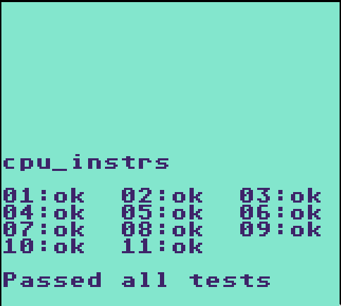
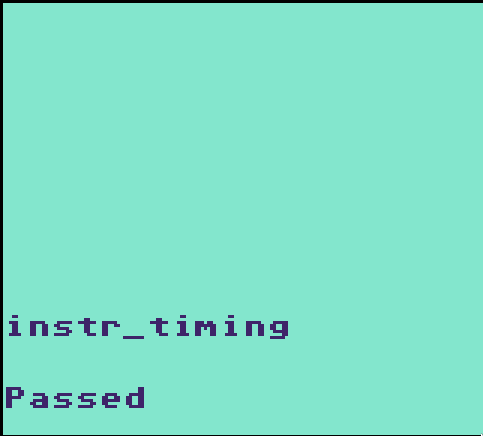
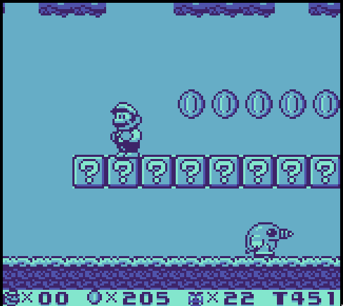
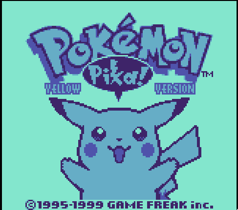

# RMG-001
Rust Matrix Game - 001: Yet Another Rust Gameboy Emulator.

This is just a fun project I'm making for learning and practice purposes. If you want a fully-featured Gameboy emulator, this is probably not the best one :P

Any help or suggestion is welcome!

# Screenshots

# TODO
- [x] CPU implementation
- [x] Interrupts
- [x] Timer
- [x] Joypad (not configurable yet)
- [x] PPU implementations
- [ ] MBC Implementations
  - [x] NoMBC
  - [x] MBC1 (Multicart not implemented)
  - [x] MBC2
  - [x] MBC3 (partially implemented, RTC missing)
  - [x] MBC5
  - [ ] MBC6
  - [ ] MBC7
  - [ ] HuC1
- [x] Save files
- [ ] Web Assembly support (because this is a Rust project and it has to support Web Assembly)
- [ ] Gameboy boot ROM (not important for now)
- [ ] Gameboy Color compatibility
- [ ] Sound
- [ ] Many code refactors and optimizations

# Resources
This project would have been completely impossible without all the documentation and help that exists online for the Nintendo Gameboy:
- The EmuDev community
- Pandocs: https://gbdev.io/pandocs/
- Gameboy emulation guide: https://hacktixme.ga/GBEDG/
- CPU opcodes table: https://izik1.github.io/gbops/
- Opcodes behaviour: https://rgbds.gbdev.io/docs/v0.5.1/gbz80.7
- Blargg's test ROMs: https://github.com/retrio/gb-test-roms
- Mooneye test ROMs: https://github.com/Gekkio/mooneye-test-suite
- Sound emulation guide: https://nightshade256.github.io/2021/03/27/gb-sound-emulation.html
- The Ultimate Gameboy talk: https://youtu.be/HyzD8pNlpwI
